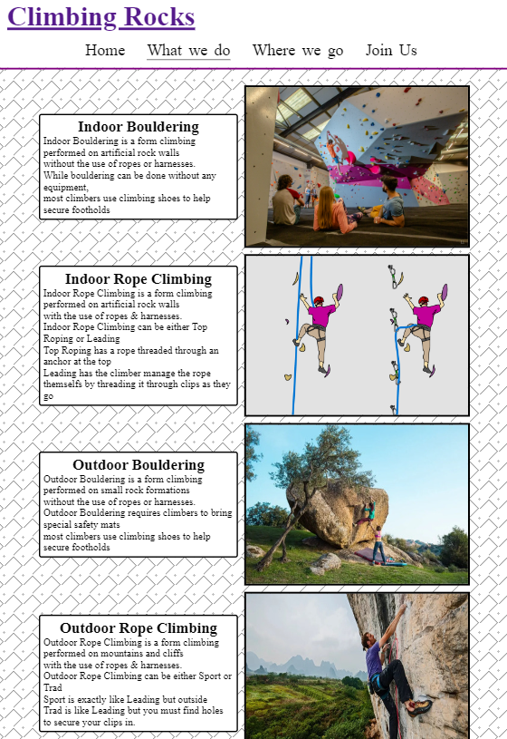

# Widnes Climbers

Widnes Climbers is a site to help people in Widnes come together and go climbing together in the surrounding area both indoors and outdoors.
The puspose is to be simple in informing people that there is a group of people who welcome others to join them.

Its aim is for climbers of Widnes to join the social medias or sign up to the newsletter if they wish.
The site is designed to present the opurtunity to join a group that is simple and friendly.
The site will target new and experienced climbers who would like company while they climb or just want to get into the sport and need encouragement.

Widnes Climbers will explain the different types of climbing the group does and when they meet. 
It will have a sign up newsletter with questions about what type of climbing the visitor is interested in, so they can be informed on when and where that type is 
and be notified of changes.
 

## Features 

### Existing Features

- __Navigation Bar__

  - Identical on every page as consistency makes it easier for the visitor to navigate the website without much effort
  - Navigation includes links to all 4 pages home , what we do , where we go and join us.
  - Navigation slides across the top of the page as the screen size changes to give a responcive feeling change that is still consistent in its general position.
  - This section will allow the user to easily navigate from page to page across all devices without having to revert back to the previous page via the ‘back’ button. 

- __The landing page__

  - The landing includes a photograph of beautiful scenery framed by rock and someone enjoying the view.
  - Landing page has text detailing the purpose of the website to the user
  - There is overlaying text to tell visitors they are in the right place and to encourage visitor to begin scrolling down.

- __What We Do page__

  - This section will allow the user to see exactly when the meetups will happen, where they will be located and what we are doing that day. 
  - This section will be updated with additional climbing types if the group expands.
  - This section is intended to be a very short incomplete education.

- __The Footer__ 

  - The footer section includes links to the relevant social media sites for Widnes Climbers. The links will open to a new tab to allow easy navigation for the user. 
  - The footer is valuable to the user as it encourages them to keep connected via social media
  - The footer was made to always be at the bottom of the page so larger screen sizes don't have blank at the bottom when there is not enough content.

- __Where We Go page__

  - The Where We Go page will provide the visitor with supporting images to see what the indoor facilities are like. 
  - The Where We Go page will provide the visitor with supporting images to see what the outdoor locations are like.
  - This section is useful for the visitor to imagine what it would be like to join the group.
  - Reviews the places the group goes

- __Join Us Page__

  - This page will allow the visitor to signed up for Widnes Climbers to receive a welcome letter and information on which part they are interested in. The user will be able specify if they are interested in bouldering , rope climbing or outdoor climbing. 
  - The visitor may select one , two or three types of climbing but must select one.
  - The visitor will be asked to submit their full name and email address. 

### Features Left to Implement

- Banner with locations and time at the bottom of every page about footer

## Testing 

Widnes Climbers was built for mobile screen sizes and then tested to see how it expands to fill a window with every meaningful change. This was done using the inspect feature mostly

It was important the navigation is always accessible on every screen size.

The presentation of text on pages was found to be difficult to read.
This was fixed by making text boxes bigger and away from images to make reading easier.

The background was found to be too distracting in testing & was made to have a higher opacity.

The footer was found to overlap content or cover the entire page. This was fixed with code from developer.mozilla.org (see credits, 'Footer-credit')

Each pages navigation is able to navigate to all pages. tested with use.

------

### Validator Testing 

- HTML
  - Section without heading, heading not needed, changed to div.
   No errors were returned when passing through the official [W3C validator](https://validator.w3.org/nu/?doc=https%3A%2F%2Fadd-faun.github.io%2FClimbers%2F)
- CSS
  - No errors were found when passing through the official [(Jigsaw) validator](https://jigsaw.w3.org/css-validator/validator?uri=https%3A%2F%2Fadd-faun.github.io%2FClimbers&profile=css3svg&usermedium=all&warning=1&vextwarning=&lang=en)

### Unfixed Bugs

Join us page image quality is low. Different file sizes and larger quality uploads did not work.

## Deployment

Widnes Climbers was deployed using github pages. 

- The site was deployed to GitHub pages. The steps to deploy are as follows: 
  - In the GitHub repository, navigated to the Settings tab 
  - Navigated to the pages section under Code and automation
  - Source chosen was deploy from branch
  - Main branch was chosen and saved, page refreshed with a working link to indicate the successful deployment. 

The live link can be found here - https://add-faun.github.io/Climbers/index.html

## Credits 

Lots of inspiration was taken from the love running website project taught by Code institute 

### Code & Styling

- Footer code to keep it at the bottom of the page and not have it overlap other content was taken from https://developer.mozilla.org/en-US/docs/Web/CSS/Layout_cookbook/Sticky_footers . This code was free use.
- Background pattern done using css is from free to use code from https://github.com/Yuvrajchandra/CSS-Background-Patterns
- The style of the form and join us page was taken from the Love running project 

### Content 

- The style of the form and join us page was taken from the Love running project (provide more links)
- The icons in the footer were taken from [Font Awesome](https://fontawesome.com/)

### Media
##### General

- Cover/hero image used on home page taken from free open source site pexel.com (pexels-m-venter-1659437)
- Join us page background image taken from free open source site pexel.com (pavel-danilyuk-7591309)
##### Where we go

- Where we go 1st image, matchworks climbing center, used to review and advertise the location we visit. Taken from their facebook https://www.facebook.com/TCHLiverpool/photos/5308587909198965/  & website https://www.theclimbinghangar.com/media/3103/hangar_swansea_l-lonsdale__0508-2-edit-x2.jpg?center=0.483091787439614
- Where we go 2nd image, boardroom climbing center, used to review and advertise the location we visit. Taken from their website https://www.theboardroomclimbing.com/
- Where we go 3rd image showing outdoor bouldering taken from subscription image site dreamstime.com https://www.dreamstime.com/stock-photo-couple-bouldering-happy-boulders-women-climbing-men-spotting-image55085115
- Where we go 4th image showing man climbing a mountain from image site getty.com
- Where we go 5th image showing people at a pub taken from free open source site pexel.com
##### What we do 

- What we do 1st image showing indoor bouldering, used for education, taken from xxxx
- What we do 2nd image showing two types of rope climbing taken from https://www.vdiffclimbing.com/basic-top-rope/
- What we do 3rd image showing two women bouldering outdoors taken from climbinghouse.com
- What we do 4th image showing man climbing a mountain from image site getty.com